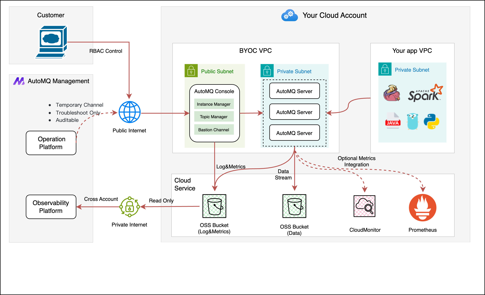

# AutoMQ for Kafka BYOC 版服务使用文档

## 概述
AutoMQ for Kafka BYOC 版是 AutoMQ 基于云原生基础设施重新设计实现的新一代 Kafka 商业发行软件，支持在公有云 VPC 私有网络环境中私有化安装和自主管理。

在保持和 Apache Kafka 100% 兼容前提下，AutoMQ 可以为用户提供 50%+ 的成本优势以及百倍的弹性优势，同时支持秒级分区迁移和流量自动重平衡，解决运维痛点。

AutoMQ for Kafka BYOC 版服务使用阿里云计算巢私有化部署方案，将 AutoMQ Kafka 软件部署到用户自定义的 VPC 和子网下，后续用户访问服务均位于自定义的私网内。

AutoMQ for Kafka 同时还提供了全托管服务形态的 SaaS 版，详情请参考 [AutoMQ 官网](https://automq.com/)。

## 计费说明

AutoMQ for Kafka BYOC 版是将软件部署在用户账号下的机器资源上，因此用户使用 AutoMQ Kafka BYOC 版需要为以下资源付费：

**云资源费用，用户直接向阿里云支付**

底层付费云资源主要包括：
- ECS 机器：AutoMQ Kafka 需要 ECS 部署控制台和 Kafka 集群数据节点。
- EBS 云盘：AutoMQ Kafka 需要少量的云盘存储服务端日志和基础元数据。
- OSS 存储：AutoMQ Kafka 使用 OSS 存储消息数据，因此会消耗 OSS 的存储空间和 API 调用。
- 公网费用（可选）：如果用户选择从公网访问控制台和服务，则可能会产生公网流量费用。

**软件服务费，用户向 AutoMQ 服务方支付**

AutoMQ Kafka 面向企业客户提供 BYOC 版商业服务，因此会根据用户集群的使用量按量收费，收取一定的软件服务费。关于计费详情请[参考文档](https://docs.automq.com/zh/automq-cloud/subscriptions-and-billings/byoc-env-billings/billing-instructions-for-byoc)。

BYOC 版计费方式目前支持：

- 按量付费（按小时出账）以及包年包月（按 License 规格收费）
- 计费方式：按照集群的 AKU 处理规格计费。

**重要** AutoMQ Kafka BYOC 版仅对实际创建的集群进行收费，用户开通 Kafka 服务时不会计费，只有在 AutoMQ Kafka 控制台创建实例（集群）时才会真正按照集群的 AKU 规格进行计费。

目前AutoMQ Kafka BYOC 版支持在如下 ECS 规格下部署服务：

| 规格族           | vCPU与内存           | 系统盘 | 公网带宽 |
|---------------|-------------------| --- | --- |
| ecs.r7.large | 内存型r7，2vCPU 16GiB | ESSD云盘 40GiB PL0 | 自定义按需 |
| ecs.r6.large | 内存型r6，2vCPU 16GiB | ESSD云盘 40GiB PL0 | 自定义按需 |
| ecs.u1-c1m8.large | 通用算力 u1，2vCPU 16GiB | ESSD云盘 40GiB PL0 | 自定义按需 |

如需更多规格、其他服务（如集群高可用性要求、企业级支持服务等），请 [联系我们](https://automq.com/)。

## 部署架构

## 前置条件一：云账号拥有相关操作权限
开通并使用 AutoMQ Kafka BYOC 版服务，需要操作云账号具备如下权限：
1. 创建授权策略、角色。
2. 开通云市场商品。
一般建议主账号或者具备管理权限的子账号进行操作。

## 前置条件二：已经开通相关云服务依赖
AutoMQ Kafka BYOC 版依赖如下云产品，建议提前开通。
1. [弹性计算 ECS](https://ecs.console.aliyun.com)。
2. [对象存储 OSS](https://oss.console.aliyun.com)。
4. [PrivateZone](https://dnsnext.console.aliyun.com)。

## 使用流程
在上述前置条件满足的情况下，开通 AutoMQ Kafka BYOC 版订阅服务。

开通服务后，请前往 [AutoMQ BYOC 版文档中心](https://docs.automq.com/zh/automq-cloud/getting-started/install-byoc-environment/alibaba-cloud) 查看详细的使用流程和操作说明。

## 联系我们
欢迎通过如下方式联系我们，了解更多信息。

💻 官网：https://www.automq.com

💻 文档中心：https://www.automq.com/docs

🌟GitHub：https://github.com/AutoMQ/automq

👀 B站：AutoMQ官方账号

🔍 微信二维码：

